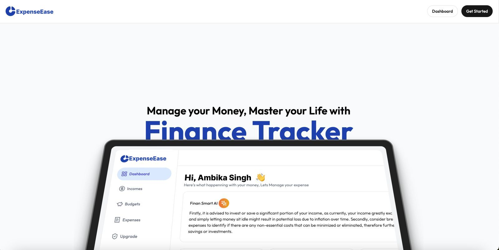
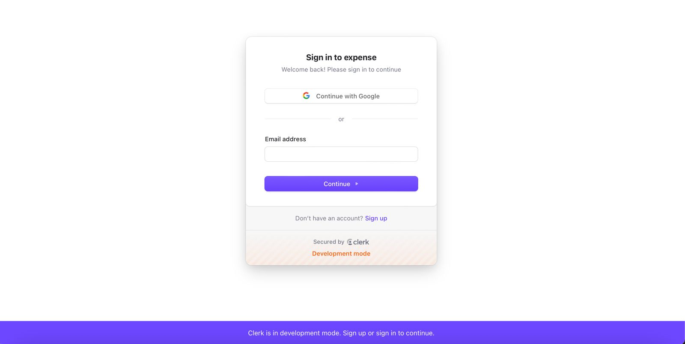
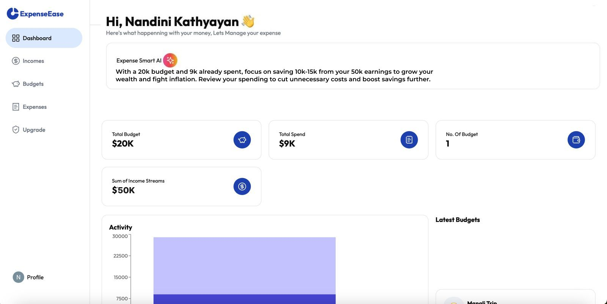
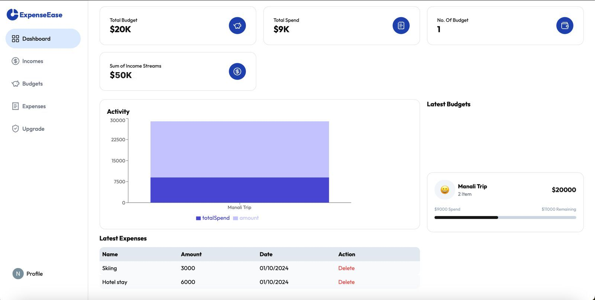

# ExpenseEase: Expense Tracker

## Overview
Finsmart is a cutting-edge financial tracking tool developed using Next.js and TypeScript. It empowers users to monitor their income, expenses, and manage budgets efficiently. Additionally, it offers tailored financial advice by leveraging data inputs from users and integrating OpenAI's GPT-4.

## Key Features
- **Income and Expense Tracking**: Easily log your earnings and expenditures.
- **Budget Management**: Organize and control your finances with effective budgeting tools.
- **Custom Financial Insights**: Receive personalized recommendations and advice based on your financial inputs, powered by OpenAI’s GPT-4 model.
- **Cross-Device Compatibility**: Enjoy a smooth and responsive experience on all devices.

## Technology Stack
- **Framework**: Next.js
- **Language**: TypeScript
- **AI Integration**: OpenAI API (GPT-4)
- **Styling**: Tailwind CSS

# App Images

  
  

  
  

